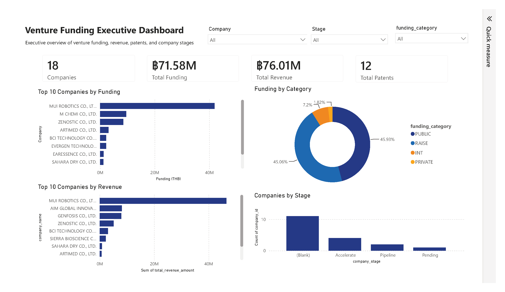
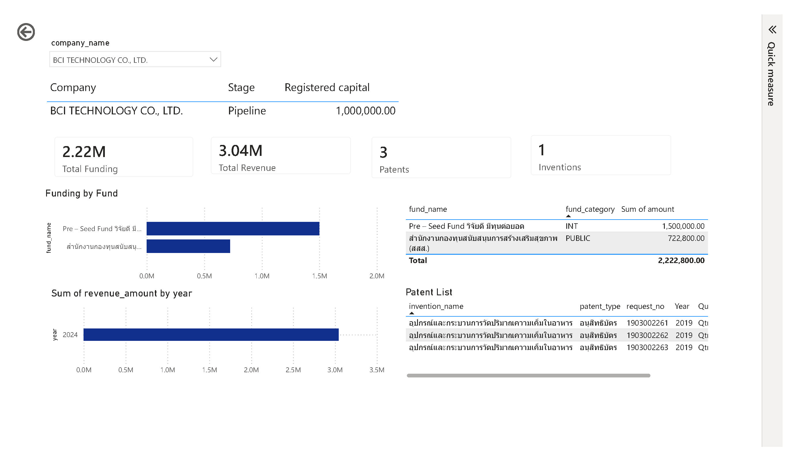
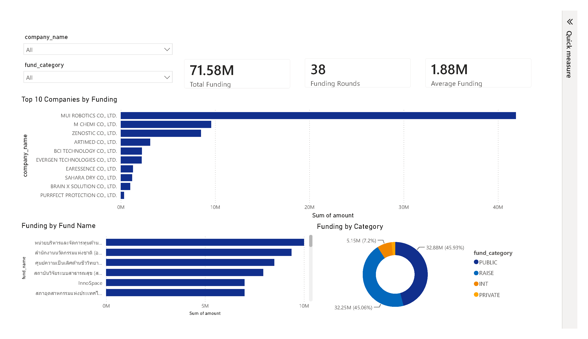
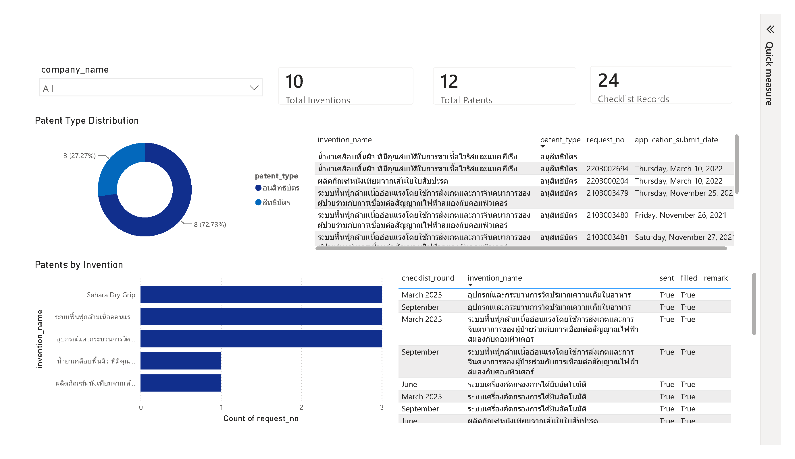

# Venture Funding ETL & Analytics

An end-to-end Data Engineering and Business Intelligence project that imports Venture Funding data from Excel into PostgreSQL using Python ETL and visualizes business insights with Power BI.

---

## Project Overview

This project demonstrates a complete data pipeline from raw Excel data to an interactive Business Intelligence dashboard.

The project covers the complete data lifecycle:

- Extract data from Excel
- Transform and clean data using Python
- Load into PostgreSQL
- Design a normalized relational database
- Create SQL Views for reporting
- Build interactive Power BI dashboards
- Manage source code using Git & GitHub

---

# Project Architecture

```text
                Excel Dataset
                     │
                     ▼
              Python ETL Pipeline
                     │
                     ▼
             PostgreSQL Database
                     │
                     ▼
              SQL Views (BI Layer)
                     │
                     ▼
            Power BI Dashboard
```

---

# Technology Stack

| Technology | Purpose |
|------------|---------|
| Python | ETL Pipeline |
| PostgreSQL | Relational Database |
| SQL | Data Transformation & Reporting |
| Power BI | Business Intelligence Dashboard |
| Git | Version Control |
| GitHub | Project Repository |
| draw.io | ER Diagram |

---

# Database Design

## Entity Relationship Diagram


The database is fully normalized and designed for analytical reporting.

Main entities include:

- Company
- Company Stage
- Company Fund
- Company Revenue
- Fund Category
- Fund Subcategory
- Invention
- Patents
- Valuation Records
- Checklist Records

---

# ETL Pipeline

```text
Excel
    │
    ▼
raw_excel_import
    │
    ▼
Data Cleaning & Transformation
    │
    ▼
Normalized Database
```

Import sequence:

```text
01_import_excel_to_staging.py
02_import_to_staging.py
03_import_company.py
04_import_fund_category.py
05_import_fund_subcat.py
06_import_company_stage.py
07_import_company_fund.py
08_import_company_revenue.py
09_import_invention.py
10_import_patents.py
11_import_valuation.py
12_import_checklist.py
```

---

# Database Statistics

| Table | Records |
|--------|--------:|
| Company | 18 |
| Fund Category | 4 |
| Fund Subcategory | 33 |
| Company Stage | 7 |
| Company Fund | 38 |
| Company Revenue | 21 |
| Invention | 10 |
| Patents | 12 |
| Valuation Records | 8 |
| Checklist Records | 24 |

---

# Power BI Dashboard

The project includes four interactive dashboard pages designed for different business perspectives.

---

## Executive Dashboard

Provides an executive-level overview of venture funding performance.

### Features

- Total Companies
- Total Funding
- Total Revenue
- Total Patents
- Top 10 Companies by Funding
- Funding by Category
- Revenue by Company
- Companies by Stage



---

## Company Profile

Displays detailed information for an individual company.

### Features

- Company Information
- Funding Summary
- Revenue Summary
- Funding by Fund
- Funding Records
- Revenue History
- Patent List
- Checklist Status



---

## Funding Analysis

Provides insights into venture funding activities.

### Features

- Total Funding
- Funding Rounds
- Average Funding
- Funding by Category
- Funding by Fund Name
- Top Companies by Funding



---

## Innovation Dashboard

Analyzes innovation and intellectual property information.

### Features

- Total Inventions
- Total Patents
- Patent Type Distribution
- Patents by Invention
- Patent List
- Checklist Status



---

# Project Structure

```text
venture-funding-etl/

├── Dashboard/
│   └── venture_funding_dashboard.pbix
│
├── docs/
│   ├── erd.png
│   └── images/
│       ├── executive_dashboard.png
│       ├── company_profile.png
│       ├── funding_analysis.png
│       └── innovation_dashboard.png
│
├── sql/
│
├── src/
│
├── data/
│
├── README.md
│
├── requirements.txt
│
└── .gitignore
```

---

# How to Run

## 1. Clone the repository

```bash
git clone https://github.com/tkppeanut/venture-funding-etl.git
```

---

## 2. Install Python dependencies

```bash
pip install -r requirements.txt
```

---

## 3. Configure PostgreSQL

Update the database connection in:

```text
db.py
```

Example:

```python
HOST = "localhost"
DATABASE = "venture_funding"
USER = "postgres"
PASSWORD = "your_password"
PORT = 5432
```

---

## 4. Run the ETL Pipeline

```bash
python run_all_imports.py
```

The ETL pipeline will:

- Import raw Excel data
- Clean and transform data
- Populate normalized database tables

---

## 5. Open Power BI Dashboard

Open:

```text
Dashboard/venture_funding_dashboard.pbix
```

Refresh the data connection if necessary.

---

# Skills Demonstrated

This project demonstrates practical experience in:

- Data Engineering
- ETL Development
- Relational Database Design
- SQL Querying & View Design
- Data Modeling
- Business Intelligence
- Power BI Dashboard Development
- Data Visualization
- Git Version Control
- GitHub Project Management

---

# Key Features

- End-to-end ETL pipeline from Excel to PostgreSQL
- Normalized relational database design
- SQL Views for reporting and analytics
- Interactive Power BI dashboards
- Four business-focused dashboard pages
- Git version control and GitHub documentation

---

# Future Improvements

Possible enhancements for future versions:

- Add Docker support for PostgreSQL and ETL
- Automate ETL execution with a scheduler (e.g. Airflow or Windows Task Scheduler)
- Add data validation and quality checks
- Build a star schema data warehouse
- Deploy dashboards to Power BI Service
- Add CI/CD workflow using GitHub Actions

---

# Repository

GitHub Repository

https://github.com/tkppeanut/venture-funding-etl

---

# Author

**Kantapoen**

GitHub: https://github.com/tkppeanut

LinkedIn: *(Add your LinkedIn profile here if available)*

---

## License

This project is intended for educational and portfolio purposes.